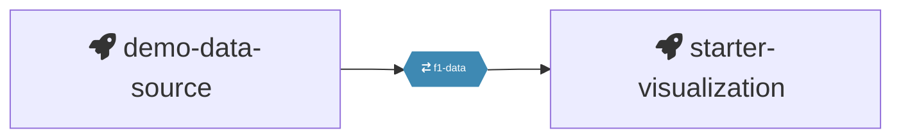
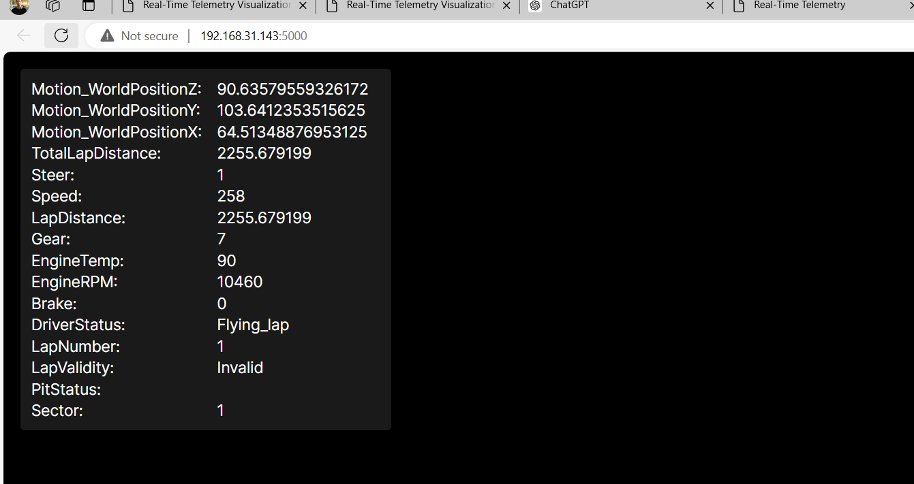
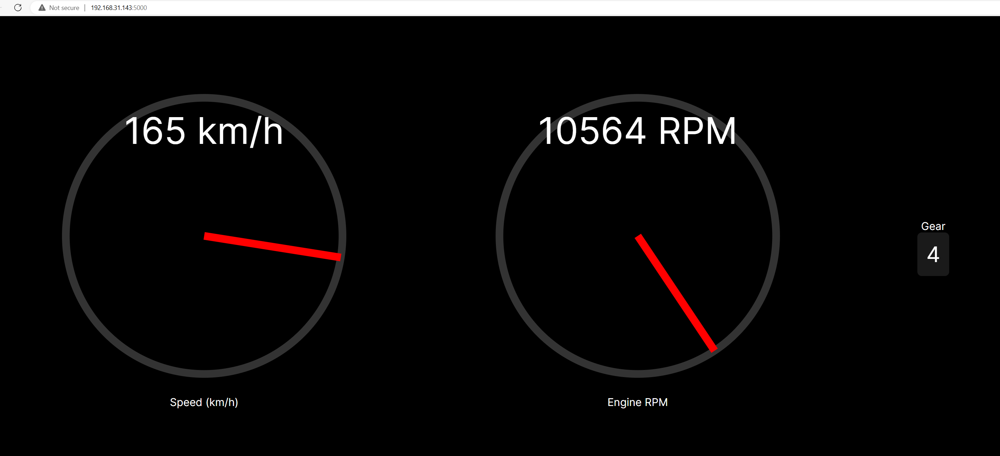

# Hackathon Quix visualization template

This template includes a real-time data processing pipeline with the following services:

- **`demo-data-source`**: A car telemetry data source for demonstration purposes.
- **`starter-visualization`**: A simple template that reads from a Kafka topic and sends data to a web page. This page can be customized via ChatGPT to create various visualizations.

## How the starter-visualization works

This application receives data from a Kafka topic and sends it to a WebSocket connection without any transformation. The same application serves an HTML webpage located at `./templates/index.html`, which reads from the WebSocket and creates a real-time visualization.

## How to use it

1. **Run the visualization application**: Ensure your data source is running.
2. **View initial visualization**: The time-series data will be displayed on the screen.
3. **Customize the visualization**:
    - Copy the content of `./templates/index.html` and paste it into ChatGPT, describing how you want your visualization to be customized.
    - Use the modified code provided by ChatGPT to replace the content in `./templates/index.html`.
    - Refresh the webpage to see the updated visualization.
4. **Iterate**: Repeat this process until you achieve the desired visualization.

## Example

- **Initial visualization**: This is the default visualization provided by the template.

  

- **ChatGPT conversation**: [View Conversation](https://chatgpt.com/share/de44d4c7-fcbf-4eb5-8919-f999ab4b1bfb)

- **Improved visualization**: After a few iterations with ChatGPT, the visualization was enhanced. However, there's potential to achieve even more with additional creativity and imagination.

  
